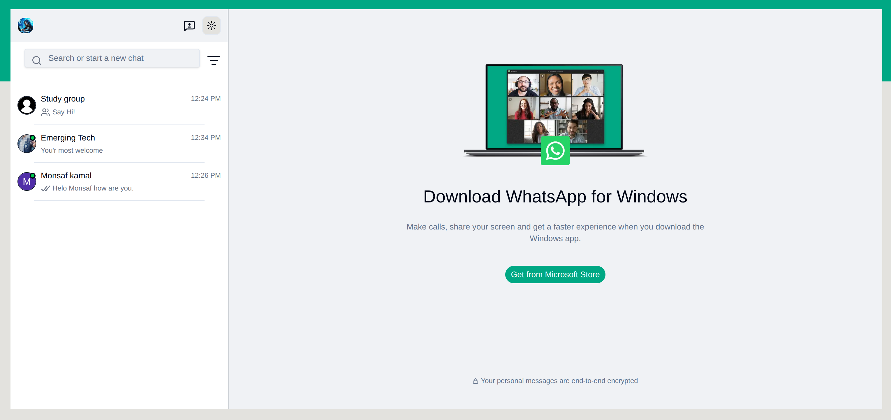

# WhatsApp Clone

A full-stack, real-time WhatsApp-inspired chat application built with **Next.js, TypeScript, Clerk, Convex, and ZEGOCLOUD**.

## 📸 Preview



## 🚀 Live Demo

[WhatsApp Clone](https://whats-app-clone-coral-mu.vercel.app/)

## ✨ Features

* 🔐 User authentication with Clerk
* 💬 Real-time one-to-one messaging
* 👥 Group conversations
* 🖼️ Image messaging
* 🎥 Video messaging
* 📹 Video calling with ZEGOCLOUD
* 🟢 Online/offline user status
* 🔎 User search
* 😊 Emoji support
* 🌓 Dark and light mode
* 🔔 Toast notifications
* 📦 Real-time database and file storage with Convex
* 📱 Responsive chat interface

## 🛠️ Tech Stack

* **Next.js 16** – Full-stack React framework
* **TypeScript** – Type safety
* **Clerk** – Authentication
* **Convex** – Real-time database, backend, and file storage
* **ZEGOCLOUD** – Video calling
* **Tailwind CSS** – Styling
* **shadcn/ui** – UI components
* **Zustand** – Client-side state management
* **Lucide React** – Icons

## 📂 Project Structure

```text
WhatsApp-clone/
├── app/
├── components/
├── convex/
│   ├── schema.ts
│   ├── users.ts
│   ├── conversations.ts
│   └── messages.ts
├── lib/
├── public/
│   └── whatsapp.png
├── store/
├── proxy.ts
├── package.json
└── README.md
```

## ⚙️ Getting Started

### 1. Clone the repository

```bash
git clone https://github.com/asia272/WhatsApp-clone.git
cd WhatsApp-clone
```

### 2. Install dependencies

```bash
npm install
```

### 3. Configure environment variables

Create a `.env.local` file:

```env
CONVEX_DEPLOYMENT=

NEXT_PUBLIC_CONVEX_URL=

NEXT_PUBLIC_CONVEX_SITE_URL=


NEXT_PUBLIC_CLERK_PUBLISHABLE_KEY=
CLERK_SECRET_KEY=
CLERK_JWT_ISSUER_DOMAIN=
CLERK_WEBHOOK_SECRET=

ZEGO_APP_ID=
ZEGO_SERVER_SECRET=
```

### 4. Start Convex

```bash
npx convex dev
```

### 5. Start Next.js

```bash
npm run dev
```

Open **http://localhost:3000**.

## 📜 Available Scripts

```bash
npm run dev
npm run build
npm run start
npm run lint
```

## 🎯 Purpose

This project was built to practice and demonstrate modern full-stack development using **Next.js, real-time databases, authentication, media handling, and video communication**.

## 👨‍💻 Author

**Asia Ashraf**

Full-Stack Web Developer from Pakistan.

GitHub: [@asia272](https://github.com/asia272)

---

⭐ If you like this project, consider giving it a star on GitHub.
